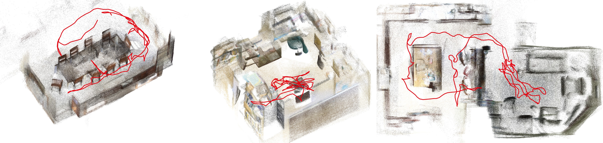

# &nbsp; MA_Long — Long-sequence SLAM / Streaming Reconstruction on MapAnything



<sub>*`ma_slam` dense reconstructions + camera trajectories (red) — scene0011 · scene0378 · scene0231.*</sub>

`ma_long` wraps Meta's **[MapAnything](https://github.com/facebookresearch/map-anything)**
foundation model into a long-sequence / streaming reconstruction system. Unlike VGGT- or
DA3-based "long" wrappers (RGB-only), it exploits MapAnything's **multi-modal input** —
optional **depth** and **intrinsics** per view — for metric, drift-resistant reconstruction.

Three interchangeable front-ends share one backbone (`MaChunkModel`) and one eval:

| front-end | file | style | when to use |
|---|---|---|---|
| **chunk pipeline** | `src/ma_long/pipeline.py` (`run.py`) | offline: overlapping chunks → SE3 align → batch loop closure | best raw accuracy, whole sequence available |
| **AMB3R online** | `src/ma_long/slam.py` (`run_slam.py`) | online: persistent confidence-fused map + keyframes | streaming, fused dense map |
| **ma_slam** ⭐ | `src/ma_slam/` (`src/ma_slam/run.py`) | **online, VGGT-SLAM-2.0-style**: submaps → SE3 factor graph (gtsam) → incremental global re-opt → stable loop closure | **recommended online**; metric, robust LC |

> **ma_slam** is the most developed and is recommended for online use: it matches or beats
> the offline pipeline in depth modes while running at ~15.5 fps, with **stable** loop closure
> (the AMB3R online LC could destabilize on loopy scenes; ma_slam's global factor graph + robust
> kernel does not).

---

## Environment

Python 3.10, `torch 2.8.0+cu128` (Blackwell `sm_120`). **Setup / dependency list →
[INSTALL.md](INSTALL.md).**

With your env activated, run the CLIs **as scripts from the repo root** — they self-bootstrap
`src/` onto the path (no `PYTHONPATH` needed); prefix `CUDA_VISIBLE_DEVICES=N` to pick a GPU.
**Model weights**: MapAnything / DA3 / DINOv2 auto-download on first run; the SALAD checkpoint
is a one-time manual download to `src/weights/dino_salad.ckpt` — see [INSTALL.md](INSTALL.md).

---

## Quick start

```bash
# ma_slam (recommended online) — ScanNet-style scene dir (rgb/, depth/, intrinsic.txt, gt_pose.txt)
python src/ma_slam/run.py \
    --scene example_data/scene0378_00 --mode rgb+depth+intr \
    --out outputs/maslam_s0378 --gt example_data/scene0378_00/gt_pose.txt --submap_size 20

# ma_slam with the DA3 backbone — metric reconstruction from RGB alone (best for rgb-only /
# unreliable-depth data; --backend da3 supports rgb / rgb+intr, no depth input)
python src/ma_slam/run.py \
    --scene example_data/scene0378_00 --mode rgb --backend da3 \
    --out outputs/maslam_da3_s0378 --gt example_data/scene0378_00/gt_pose.txt --submap_size 20

# offline chunk pipeline
python src/ma_long/run.py \
    --scene example_data/scene0378_00 --mode rgb+depth+intr --out outputs/pipe_s0378 --chunk_size 20

# evaluate ATE against GT (Sim3 + metric SE3)
python src/eval.py --est outputs/maslam_s0378/camera_poses.txt --gt example_data/scene0378_00/gt_pose.txt
```

Custom (non-ScanNet) layout — pass dirs explicitly:
```bash
python src/ma_slam/run.py \
    --image_dir <imgs> --depth_dir <depth> --intrinsic <K.txt> \
    --mode rgb+depth+intr --out <out> --submap_size 20 --depth_max 6
```

### Input modes (`--mode`)
`rgb` · `rgb+intr` · `rgb+depth` · `rgb+depth+intr`. **Use depth/intr when available** —
they make the reconstruction metric (scale ≈ 1) and roughly halve metric ATE.
Judge multi-modal modes with **metric SE3-ATE**, not Sim3-ATE (Sim3 is scale-invariant and
hides depth's main benefit).

### Backbone (`--backend {ma,da3}`, ma_slam)
- **`ma`** (default) — MapAnything, all 4 modes.
- **`da3`** — **DA3NESTED-GIANT-LARGE-1.1** (`src/model/da3_infer.py`), `rgb`/`rgb+intr`
  only (DA3 doesn't ingest depth). DA3 predicts **metric** depth+poses from RGB, so it is a
  much better **rgb** backbone: SE3-ATE ~0.10 (scale ≈1.0) vs MapAnything-rgb ~0.4–0.5
  (scale 0.6–0.8) — 3–5× better, rivaling MA's *depth* modes from RGB alone (~12.5 fps).
  ```bash
  python src/ma_slam/run.py --scene example_data/scene0378_00 \
      --mode rgb --backend da3 --out outputs/da3_s0378 --gt example_data/scene0378_00/gt_pose.txt --submap_size 20
  ```

---

## Data

A "scene" is a directory of **sequential** frames. A ready-to-run example ships in
**`example_data/scene0378_00/`** (used in Quick start above). Point `--scene <dir>` at a
ScanNet-style layout, or pass `--image_dir / --depth_dir / --intrinsic` for a custom one.

```
<scene>/                                                  # e.g. example_data/scene0378_00/
  rgb/            frame_00000.png, frame_00001.png, ...   # REQUIRED — sequential RGB frames
  depth/          frame_00000.png, ...                    # optional — 16-bit PNG, millimetres
  intrinsic.txt                                           # optional — 3x3 (or 4x4) pinhole K
  gt_pose.txt                                             # optional — for ATE eval
```

| file | required? | format | used by |
|---|---|---|---|
| `rgb/*.png` | **yes** | sequential frames, any size | **all** modes / both backbones |
| `depth/*.png` | optional | 16-bit PNG, metric **mm** (`--depth_scale 1000`), aligned 1:1 with `rgb` | **`--backend ma` depth modes only** |
| `intrinsic.txt` | optional | 3×3 / 4×4 matrix (pinhole K in top-left 3×3) | **`--backend ma` `+intr`/`+depth` only** |
| `gt_pose.txt` | optional | TUM `# timestamp tx ty tz qx qy qz qw`, one row/frame | `eval.py` ATE only |

- **depth + intrinsics are optional and only matter for the MapAnything backbone** (`--backend ma`,
  modes `rgb+depth` / `rgb+intr` / `rgb+depth+intr`). A depth mode needs intrinsics too (depth is
  interpreted via K).
- **`--backend da3` uses RGB only** — no depth/intrinsics required (it predicts metric geometry
  from RGB). `--mode rgb` (either backbone) needs only `rgb/`.
- Non-standard layouts (e.g. `color/` instead of `rgb/`, separate dirs): use
  `--image_dir <imgs> --depth_dir <depth> --intrinsic <K.txt>`.

**Output per run** (written to `--out <dir>`): `camera_poses.txt` (flattened 4×4 cam→world,
one row per frame), `combined_pcd.ply`, and `run_stats.txt`/`loops.txt` (fps, VRAM, loop events).

---

## ma_slam — settings reference

`MaSlam` (`src/ma_slam/solver.py`) `DEFAULT_CONFIG` — **current validated defaults**:

| group | key | default | meaning |
|---|---|---|---|
| chunking | `submap_size` | 16 (eval uses **20**) | new frames per submap (submap = `submap_size + overlap`). Bigger → fewer seams but ~linear VRAM ↑; fps ~flat. cs20 is the sweet spot. |
| | `overlap` | 1 | shared frame between submaps (only 1 supported) |
| graph | `manifold` | `se3` | gtsam `Pose3` backend (metric). Seam for Sim3/SL4. |
| | `inner_sigma` / `intra_sigma` | 0.03 / 0.05 | odometry (intra-submap / overlap-tie) noise — trusted, tight |
| | `loop_sigma` | 0.10 | loop constraint noise (looser = less trusted) |
| | `loop_robust` / `_k` | **`huber` / 1.345** | **robust kernel on loop factors only** — auto-downweights a wrong loop (free insurance: neutral on clean loops; a gross false loop → traj err 0.17 vs 3.57 plain) |
| loop | `enable` | True | `--no_loop` to disable |
| | `sim_threshold` | 0.50 | SALAD retrieval gate (stage 1, recall) |
| | `coloc_ratio` | **0.70** | geometric verification gate (stage 2, precision): re-infer pair, accept if `‖cam-center dist‖ / median-depth < coloc_ratio`. 0.5 over-rejected real loops. |
| | `min_submap_gap` | 2 | exclude N most-recent submaps as loop targets |
| | `half_window` | **0** | verification window radius. 0 = the 2 candidate frames only. **Keep 0** — a window helps recall but worsens aliasing FPR (16%→32%) and costs fps. |
| pointcloud | `conf_coef` | 0.75 | keep points with `conf > mean(conf) * conf_coef` (export only) |
| | `max_points` | 2,000,000 | cap merged cloud (uniform random sample); `0` = no cap |
| | `voxel_size` | 0.0 | optional voxel downsample (m) |

**CLI overrides** (`src/ma_slam/run.py`): `--submap_size --no_loop --sim_threshold
--coloc_ratio --loop_half_window --voxel_size --max_points --conf_coef --depth_scale
--depth_max --max_frames --device`.

### Real-sensor depth (RealSense etc.) → use `--depth_max`
MapAnything **keeps the depth you give it** (output ≈ input to ~1 cm on provided pixels;
only `depth==0` holes get the network's own prediction). So **noisy depth in → noisy
geometry out**. RealSense depth is unreliable beyond ~5–6 m (raw far values reach 30 m+) →
the cloud sprays to ±60 m. **`--depth_max 6`** zeros depth past 6 m (turns far noise into
holes the network re-predicts cleanly) → recovers a clean reconstruction. Off by default
(ScanNet depth is clean near-range). If depth is hopeless, `rgb+intr` (skip depth) is a clean
fallback, slightly looser.

---

## ma_long chunk pipeline & AMB3R online — settings

**Pipeline** (`src/ma_long/pipeline.py`, run via `src/ma_long/run.py`): `chunk_size` 60 / `overlap` 20,
`align_method` `se3` (MapAnything is metric — **use SE3, not Sim3**), `align_lib` `torch`,
`loop_chunk_size` 20. CLI: `--chunk_size --overlap --align_method --align_lib --no_loop
--loop_sim_thresh --mode --depth_scale --gt`. Smaller chunks drift more (no loop closure) —
motivates loop closure / the online front-ends.

**AMB3R online** (`src/ma_long/slam.py`, run via `src/ma_long/run_slam.py`): `init_window` 20, `step` 8,
keyframe `threshold` 0.3, `Loop.dist` (generous, ~1/5 scene extent), co-location verify.
CLI: `--init_window --step --kf_threshold --no_loop --loop_dist`.

---

## Results (Sim3-ATE m; ma_slam submap_size 20, current defaults)

| scene (frames) | rgb | +depth | +depth+intr | offline pipeline +d+i |
|---|---|---|---|---|
| s0011 (238) | 0.150 | 0.069 | **0.059** | 0.081 |
| s0378 (190) | 0.098 | 0.051 | 0.055 | 0.054 |
| s0231 (444) | 0.140 | 0.106 | **0.099** | 0.131 (best prior) |

- In depth modes, **ma_slam (online) matches or beats the offline pipeline**.
- On s0231 (loopy), ma_slam's loop closure is **stable & helpful** (cuts ATE), where the older
  AMB3R online LC *degraded* it (0.131 → 0.30).
- **Perf:** ~15.5 fps, ~15 GB VRAM (RTX PRO 6000, submap_size 20).

**Full results + ablations** (DA3-vs-MapAnything, loop-closure tuning, submap-size sweep,
RealSense `--depth_max`, …) → **[docs/RESULTS.md](docs/RESULTS.md)**.

---

## Repo layout

`src/` layout — shared infra are top-level sibling packages (the CLI runners self-bootstrap
`src/` onto the path, so you run them as scripts):

```
src/
  ma_slam/      VGGT-SLAM-style online SLAM (run.py, solver/graph/submap/map/loop)
  ma_long/      offline chunk pipeline (pipeline.py/run.py) + AMB3R online (slam.py/run_slam.py) + tools/ configs/
  model/        MaChunkModel (MapAnything) + Da3ChunkModel (DA3) + multi-modal input assembly  [shared]
  align/        SE3/Sim3 geometry + robust IRLS alignment   [shared; pulls in fastloop/]
  loop/         SALAD/DINOv2 VPR loop detector              [shared]
  fastloop/     Sim3 solver (Python fallback)               [shared]
  weights/      dino_salad.ckpt (downloaded per INSTALL.md) [shared]
  eval.py       Sim3 + metric SE3 ATE                       [shared]
example_data/   shipped runnable scene (scene0378_00)
thirdparty/     external repos, cloned separately (INSTALL.md) — git-ignored
outputs/        run outputs (git-ignored) · data/  your own datasets (git-ignored)
```

`ma_slam` and `ma_long` are independent front-ends sharing `model`/`align`/`loop`/`fastloop`/
`weights`/`eval`. Vendoring rule: do not runtime-import the `thirdparty/` repos — the only
external model deps are `mapanything` (pip) and, for `--backend da3`, `depth_anything_3`
(source clone). See `CLAUDE.md` for full implementation notes.
